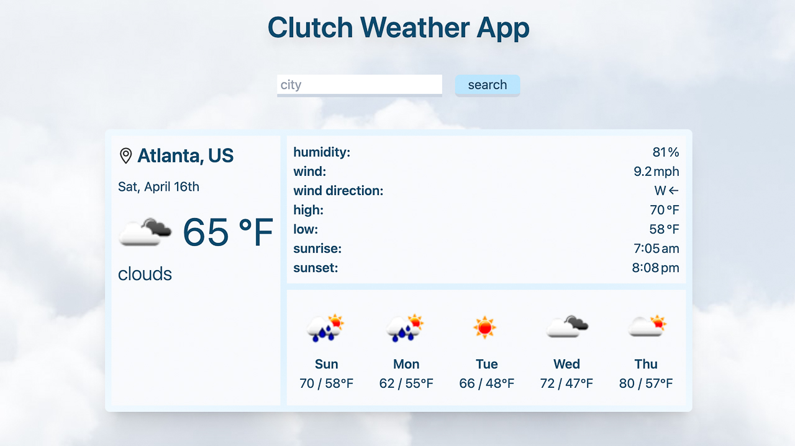

# Clutch Weather App  

  

A weather app that you can depend on when you need it most. Search any city in the world and retrieve current weather details.  

## Installation
1. Clone repo by running `git clone https://github.com/simonxcode/clutch-weather-app.git` in your terminal   
2. Install dependecies    
`yarn install` or `npm install`

3. Start server in development mode(at [localhost:8000](http://localhost:8000/))    
`yarn start` or `npm start`

4. When adding new classes to Tailwind, compile with     
`yarn build:css` or `npm build:css`
>**note:** run `yarn build:watch` for active updates  

5. Build and compile application for production    
`yarn build` or `npm build`

## Credit
Project inspiration from [the ultimate api challenge](https://theultimateapichallenge.com/weather-api-react)     
Background photo from [unsplash](https://unsplash.com/photos/8hnTBXjJd2s)    
App Icons from flaticon [freepik](https://www.flaticon.com/authors/freepik) and [iconixar](https://www.flaticon.com/authors/iconixar)    

## License
This project is open source and available under the [MIT License](LICENSE). 
